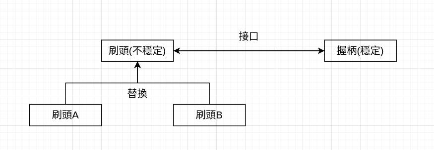
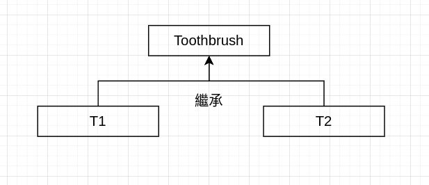
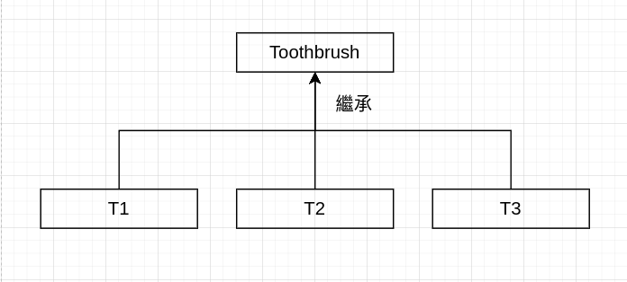
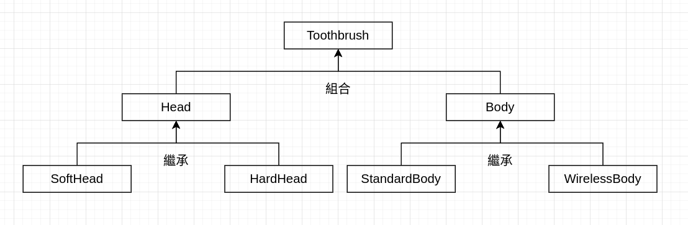
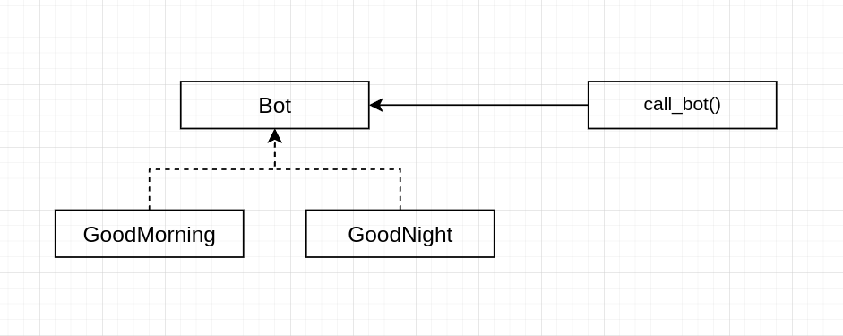
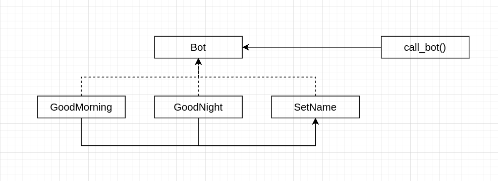
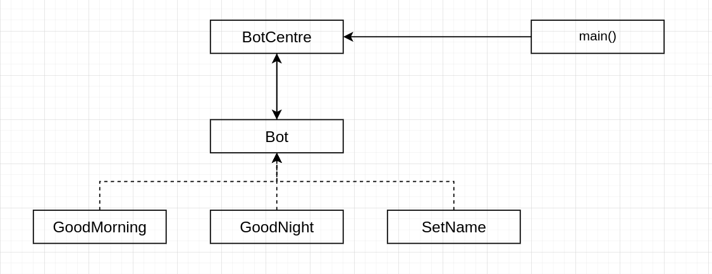
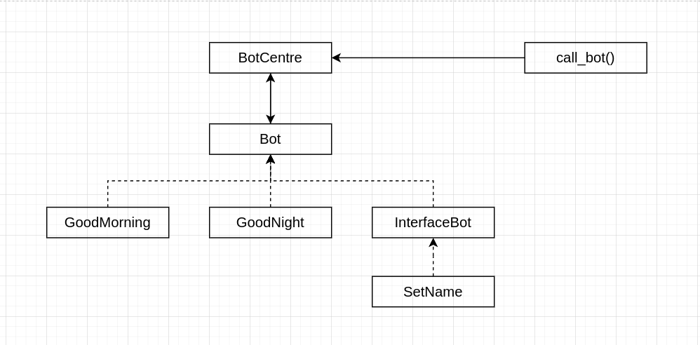
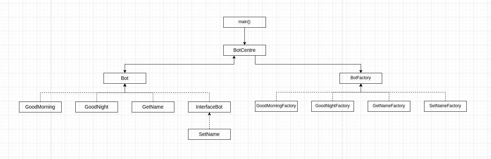

# 前言

說起學習程式設計的過程，
一開始當然是學習程式的語法，想辦法去讓程式能跑出正確的結果；
再來就是研究進階的技巧，讓程式能實現自己想要的功能。
但如果繼續學習下去，
此時就會去思考程式怎麼寫才能叫做好的設計？

以前在寫程式的時候常常會有這樣的困擾。
要讓程式有沒有正確的執行很容易判斷，
但是判斷程式設計的是否合理卻很難。
在學校的學習的過程中雖然多少會有一些概念，
諸如“好的程式不應該寫死，要保留彈性”或是“類別不應該對外暴露不必要的方法”。

但是這樣粗淺的認知在實際工作中會遇到很多問題，
比如“好的程式要保留彈性”，這邊的彈性是指什麼的彈性？
我設計了一個函數可以接受不定數量的輸入，這樣算有彈性嗎？
又或者“類別不應該對外暴露不必要的方法”，什麼樣的方法叫做不必要的方法？
我設計了一個容器有兩種刪除元素的方法，
一個是通過指定key刪除，一個是通過指定value刪除，
但是我其實可以通過先查詢後刪除的方式來替代另一個方法，
這樣算不算暴露不必要的方法？

對於有類似這類困擾的人，希望這篇對你有幫助。

# 設計模式/原則

對於前面的這些問題，最主要的根源就是沒有搞清楚程式設計的目的。

程式設計的目的是爲了**易於維護**。
如果只是爲了執行正確就好，那麼並不需要保留彈性；
如果只是爲了使用方便，那麼不需要在意對外暴露了不必要的方法。

那麼我們就有了一個新的問題，什麼樣的程式才叫做易於維護？

通常來說我們需要考慮到註釋是否清晰易懂，
命名是否準確合適，
是否有完善的測試流程，諸如此類。
但是本篇單純從程式設計的角度討論，
相信大家都有這樣的經驗：
把程式寫完成後，要增加新功能會很困難，因爲很容易把原本的程式改壞掉。

原因就是程式寫出來只需要考慮當下的功能，
而往裡面增加新功能，有可能需要修改原本的程式，
這時候不僅要讓新功能可以運作，還要保證原本的功能不會被破壞。
而如果你設計出的程式結構可以使你的程式可以很容易的加入新的功能，
並且不會破壞原本的功能。
那麼我們會說這樣的程式更易於維護。

而人們發現易於維護的程式結構可以歸納成23種類型，
每種類型都對應著不同的情況，
人們就把這些類型的設計統稱爲設計模式。

## 設計模式

但是我並不建議直接去學習設計模式，
而是應該先瞭解設計原則。

如果你現在在網路上搜設計模式，應該會看到諸如“23種設計模式詳解之類”的，
相信我如果你點進去大概看不到一半就會暈掉。
主要是很多模式都很像，
如果完全沒有一些設計原則的概念，很容易就看得雲裡霧裡。
最後把設計模式當成公式亂套，很容易把錯誤的模式套用在問題上。

而反過來說，如果你已經有了一些設計原則的概念，即使你不去看設計模式，你也已經懂了設計模式。
你可以把設計模式看成是這些設計原則的延伸，
所以瞭解設計原則比瞭解設計模式更重要。

另一個說服你為什麼設計模式不是那麼重要的理由是，其實設計模式是在[1994年](https://zh.wikipedia.org/zh-tw/%E8%AE%BE%E8%AE%A1%E6%A8%A1%E5%BC%8F%EF%BC%9A%E5%8F%AF%E5%A4%8D%E7%94%A8%E9%9D%A2%E5%90%91%E5%AF%B9%E8%B1%A1%E8%BD%AF%E4%BB%B6%E7%9A%84%E5%9F%BA%E7%A1%80)被提出來的。
而其中的一些模式要解決的問題已經被現在一些新語言的特性所解決了，所以學習設計模式的意義並沒有學習設計原則來得大。
因為設計模式可能會過時，但是其背後代表的設計原則是不會過時的。

## 設計模式的核心概念

但在介紹設計原則前我們需要先說明一下設計模式的一個核心概念，
因爲設計原則是圍繞設計模式的核心概念展開的。

這邊通過一個手機的例子來說明，
大家知道現在的智慧型手機比較精密，所以比較不耐摔。
如果現在你是設計師，要讓原有的一款智慧型手機變得比較耐摔，你會怎麼做:
* 方案1: 重新設計手機結構增加結構強度
* 方案2: 幫手機設計一款手機殼

相信大家都會選擇方案2，方案1實在太費力了，而且還有失敗的風險。
方案2則很好的展現了一個合理的解決思路，就是往原本的東西上加東西，比修改原本的東西來的容易。
對應到程式中就是：
**當我們要加入一個新功能的時候，應該是在不要改到原本程式的前提下增加新的程式。**

這邊再舉一個電動牙刷的例子，電動牙刷分成刷頭的部份跟握柄的部份。
而通常比起握柄內的電動馬達，刷頭的部份是比較容易壞的。
而當刷頭壞掉的時候，應該沒有人會去買一個新的牙刷或是去找人修好刷頭吧，通常是拿一個新的刷頭替換掉。
關鍵的地方來了，如果現在出了一個新款的刷頭，請問你需要購買新的牙刷嗎？
事實上你只需要把新款的刷頭裝在現在的牙刷上即可。

而這個例子中我們可以發現，如果要升級現有的刷頭並不一定需要修改掉原來牙刷的設計。
原因是原有的牙刷採用的是模組化的設計，不同的模組可以替換，這樣就保證了結構上的彈性。
**對應到程式上，就是我們在設計的時候預先料到某個部份在未來會發生變動，
於是我們採用模塊化的設計，把未來會變動的部份獨立出去，
而穩定與不穩定的部份通過一個穩定的接口連接。**
對應到牙刷上就是刷頭與握柄之間的接口是固定的，未來所有的刷頭只要保證能接上握柄就都可以正常運作。



通過上面的設計，未來無論出現了什麼樣的新刷頭，都可以很容易的加入到牙刷中，
而不會修改到原有的部份，因為這隻牙刷的存在是依靠一個穩定的框架而實現的。
而這就是設計模式的核心概念，所謂設計模式的模式就是某種穩定的抽象框架，
在這種框架下可預期的程式碼的修改都被控制在某個模組內，
所以使用了設計模式的程式碼加入新功能可以很容易的做到。

## 設計原則

前面講了設計模式的目的就是讓程式可以易於維護，
具體作法就是通過一個穩定的框架將變化控制在某一個模組中。
而程式穩定的地方不同也就產生了不同的框架，
或者以可以說是不同的設計模式。

現在我們來思考，假如我遇到了一個現實的問題，
然後我們發現了程式碼中有一些變化的部份，也有一些穩定的部份，
於是我們設計了一個框架，把不同的部份對應到某個模組中。
然後我們大公告成了嗎？

在前面牙刷的例子中大致展示了設計模式的精神，但是實際到程式碼中，情況會變得稍微複雜一些。
主要是因為物件之間除了有組合關係還有繼承關係，二者之間合起來可以產生千變萬化的結果。
所以從牙刷的例子雖然很有啟發，但要直接對應到程式碼如何設計，我們的準備還不夠完備。
為了在複雜的系統中保證我們設計的系統是合理的，有人總結歸納了五個設計原則，
**這五個設計原則定義了一個合理的設計應該滿足什麼樣的條件**，
也就是說就算你的設計模式是你發明的，只要不違反這五個設計原則就是合理的，
所以在設計程式的架構時可以使用這五個設計原則來檢查。

下面請容我介紹五大設計原則:
1. 依賴反轉原則
2. 開放封閉原則
3. 單一職責原則
4. Liskov替換原則
5. 介面隔離原則

第一次看到這麼多原則應該會傻眼，但是相信我上面這些原則有些你都已經在前面牙刷的例子中學會了。
下面我一條條說明:

### 依賴反轉原則

所謂`依賴反轉原則`就是指穩定的東西不能依賴於變化的東西;而變化的東西應該依賴穩定的東西。
講白話就是牙刷應該是刷頭(變化)依賴於接口(穩定)，而不是反過來。

### 開放封閉原則

也就是程式碼可以加東西，但不要修改內容。
這個直接看例子比較好理解。

錯誤示範：
```python

def say_hello(friend):
    if friend.country == "United Kingdom":
        print("hello")

    elif friend.country == "France":
        print("Bonjour")
        
    # 加入新的國家需要修改原來的程式碼
    elif friend.country == "Russia":
        print("привет")
```

正確示範：

```python
class UnitedKingdom:
    name = "United Kingdom"
    hello = "hello"

class France:
    name = "France"
    hello = "Bonjour"

class Russia:
    name = "Russia"
    hello = "привет"


def say_hello(friend, country_list):
    # 加入新的國家不需要修改原來的程式碼
    for country in country_list:
        if friend.country == country.name:
            print(country.hello)
            break

```

### 單一職責原則

也就是說每個類別應該只有一個變化的方向，
下面是一個例子。

正確示範：

```python
class Toothbrush(abc.ABC):
    @abc.abstractmethod
    def get_head(self):
        return NotImplemented


class T1(Toothbrush):
    def get_head(self):
        return "軟質刷頭"


class T2(Toothbrush):
    def get_head(self):
        return "硬質刷頭"
```



錯誤示範：
```python
class Toothbrush(abc.ABC):
    @abc.abstractmethod
    def get_head(self):
        return NotImplemented
    
    @abc.abstractmethod
    def get_body(self):
        return NotImplemented

    
class T1(Toothbrush):
    def get_head(self):
        return "軟質刷頭"
    
    def get_body(self):
        return "標準版"
    

class T2(Toothbrush):
    def get_head(self):
        return "硬質刷頭"
    
    def get_body(self):
        return "標準版"


class T3(Toothbrush):
    def get_head(self):
        return "軟質刷頭"
    
    def get_body(self):
        return "無線充電版"

```



這邊需要注意的是所謂"一個變化的方向"，
並不是說只能有一個方法或函數不同，而是說只能在某一個功能(或是說職責)上有所變化。

你可能會有個疑問，那如果我的牙刷就需要不同的刷頭跟握柄怎麼辦?
我們會使用組合的方式來取代繼承:

```python

class Head(abc.ABC):
    @abc.abstractmethod
    def get_head(self):
        return NotImplemented
    
class SoftHead(Head):
    def get_head(self):
        return "軟質刷頭"

class HardHead(Head):
    def get_head(self):
        return "硬質刷頭"


class Body(abc.ABC):
    @abc.abstractmethod
    def get_body(self):
        return NotImplemented
    
class StandardBody(Body):
    def get_body(self):
        return "標準版"

class WirelessBody(Body):
    def get_body(self):
        return "無線充電版"


class Toothbrush:
    def __init__(self, head: Head, body: Body):
        self.head = head
        self.body = body
        
    def get_head(self):
        return self.head.get_head()
    
    def get_body(self):
        return self.body.get_body()

```



### Liskov替換原則

講白話就是父類能做到的事情，子類也要能做到。
換句話來說就是父類定義的函數所實現的功能，子類也必須要有。

還有一種容易誤會的情況是如果子類重載(Override)父類的函數，這樣是否違反原則？
很顯然這取決於你對父類所要求的行為，在子類上是否可以實現。
例如父類有一個函數的功能可以把輸入的英文翻譯成中文再輸出，
如果子類不僅可以翻譯英文還可以翻譯法文，那當然沒有違反原則。
但如果子類改成只能翻譯法文，那當然不行。


### 介面隔離原則

簡單來說就是類別對外給別人使用的函數越少越好。
這也很好理解，如果對外開放的接口越多，被外部使用到的接口就越多。
而這就導致類別需要保持穩定的接口就越多，等於提高了維護成本。

你可能會聯想到前面容器的例子:
```
我設計了一個容器有兩種刪除元素的方法， 一個是通過指定key刪除，一個是通過指定value刪除， 但是我其實可以通過先查詢後刪除的方式來替代另一個方法， 這樣算不算暴露不必要的方法？
```

這個問題其實沒有標準答案，
但可以這樣思考:
* 如果你的模組是面向系統外部的，
那麼你應該考慮提供儘可能完善的接口。
* 如果你的模組是面向系統內部的，
那麼你應該考慮提供儘可能精簡的接口。

會認爲介面隔離原則是用來思考這類問題的想法，
其實是一個常見的誤區。
介面隔離原則更多的是不要讓外部有**機會**使用到私有的接口。

下面是一個簡單的例子：
```python
class Counter:
    def __init__(self):
        self.counter = 0

    def add_one(self):
        self.counter += 1
```

我們設計了一個計數器，可以查看計數和將計數加一。
但是這樣的問題在於使用者有可能直接修改`Counter.counter`，
這樣違反了設計者的意圖。

應該改成：
```python
class Counter:
    def __init__(self):
        self.__counter = 0

    def add_one(self):
        self.__counter += 1

    def get_counter(self):
        return self.__counter
```


# 實際例子

下面就以一個聊天機器人的程式為例子，
來示範如何如何把設計原則應用到一個系統設計中。
在等會的過程中會一步步將原本不太合理的設計改進到合理的狀態。

## 版本一: 原版

下面是一個簡單的例子。

程式碼1.1：

```python
def call_bot(user_id, message):
    if message == "早安":
        print(f"早安,{user_id}")

    elif message == "晚安":
        print(f"晚安,{user_id}")

    # 加入新的對話功能需要修改這裡

def main():
    call_bot("a1234", "早安")  # 早安,a1234
    call_bot("b5678", "早安")  # 早安,b5678
    call_bot("a1234", "晚安")  # 晚安,a1234
```

在當前例子中，如果我們要加入新的對話功能，一定會需要修改到`call_bot`中的程式碼，
這顯然違反`開放封閉原則`。
也許可能有人會認為這種修改不太可能破壞程式，
但是當程式越來越複雜後，
在其中修改的任何程式碼所造成的影響都是無法預期的。


## 版本二: 模組化

下面是修改後的程式碼，
我們將不同的對話功能模組化成不同的類別，並確保類別只能有一個實例。
也許有人會想為什麼不使用函數而是類別?
使用函數也是不錯的選擇，但是使用類別的話就可以保存使用者的資訊，
這樣可以比單純的函數來說有更多可能性。

程式碼2.1：

```python
class GoodMorningBot:
    
    instance_ref = None

    def __new__(cls):
        # 確保 GoodMorningBot 只能有一個實例
        if cls.instance_ref is None:
            return super().__new__(cls)
        return cls.instance_ref
    
    def __init__(self):
        # 確保實例不會被重複初始化
        if self is GoodMorningBot.instance_ref:
            return
        GoodMorningBot.instance_ref = self

    def should_handle_message(self, user_id, message) -> bool:
        return message == "早安"

    def run(self, user_id, message):
        print(f"早安,{user_id}")


class GoodNightBot:
    
    instance_ref = None

    def __new__(cls):
        # 確保 GoodMorningBot 只能有一個實例
        if cls.instance_ref is None:
            return super().__new__(cls)
        return cls.instance_ref
    
    def __init__(self):
        # 確保實例不會被重複初始化
        if self is GoodNightBot.instance_ref:
            return
        GoodNightBot.instance_ref = self
    
    def should_handle_message(self, user_id, message) -> bool:
        return message == "晚安"

    def run(self, user_id, message):
        print(f"晚安,{user_id}")


# 加入新的功能不需要修改原來的程式碼
bot_list = [GoodMorning(), GoodNight()]

def call_bot(user_id, message):
    for bot in bot_list:
        if bot.should_handle_message(user_id, message):
            bot.run(user_id, message)
            break

def main():
    call_bot("a1234", "早安")  # 早安,a1234
    call_bot("b5678", "早安")  # 早安,b5678
    call_bot("a1234", "晚安")  # 晚安,a1234
```

在上面的程式碼中我們把不同對話功能包裝成不同的模組，
也就是`GoodMorningBot`和`GoodNightBot`。
把原來的判斷是否回應和bot具體回應的功能變成兩個不同的方法。
雖然兩個類別不同，但是使用了相同的接口，所以可以通過依賴固定的接口，
來達成整個系統的穩定，也就是滿足了`依賴反轉原則`。

然後會發現兩個類別有相同的接口，所以可以讓他們繼承同一個父類，
然後在父類規範其子類必須滿足`should_handle_message`和`run`接口。
並且我們還可以把共同的程式碼丟給父類，這樣子類看起來也比較美觀。

程式碼2.2：

```python
import abc


class Bot(abc.ABC):
    
    instance_ref = None

    def __new__(cls, *args, **kwargs):
        if cls.instance_ref is None:
            return super().__new__(cls)
        return cls.instance_ref

    def __init__(self):
        if self is self.__class__.instance_ref:
            return
        self.__class__.instance_ref = self

    @abc.abstractmethod
    def should_handle_message(self, user_id, message) -> bool:
        return NotImplemented

    @abc.abstractmethod
    def run(self, user_id, message):
        return NotImplemented


class GoodMorning(Bot):
    def should_handle_message(self, user_id, message) -> bool:
        return message == "早安"

    def run(self, user_id, message):
        print(f"早安,{user_id}")


class GoodNight(Bot):
    def should_handle_message(self, user_id, message) -> bool:
        return message == "晚安"

    def run(self, user_id, message):
        print(f"晚安,{user_id}")


bot_list = [GoodMorning(), GoodNight()]

def call_bot(user_id, message):
    for bot in bot_list:
        if bot.should_handle_message(user_id, message):
            bot.run(user_id, message)
            break

####################### main 略 #######################
```

我們可以把它們之間的關係畫成圖:



我們用虛線表示繼承關係，用實線表示之間存在接口依賴。

可以很容易的看出我們通過模塊化的設計，
把未來會變動的部份獨立出去，
穩定與不穩定的部份通過一個穩定的接口連接。

## 版本三: 資料交換

接下來我們需要為bot加入一個的功能，現在用戶可以取名字了，
這樣就不會用id來稱呼用戶了，感覺比較親切！

下面是我們加入的新類別:

程式碼3.1：

```python
class SetName(Bot):
    def __init__(self):
        super().__init__()
        self.name_dict = {}

    def should_handle_message(self, user_id, message) -> bool:
        return message[:8] == "setname:"

    def run(self, user_id, message):
        user_name = message[8:]
        self.name_dict[user_id] = user_name
        print(f"命名成功！{user_name}")
```

舉例，用戶輸入:`setname:小明`，用戶就會被取名為小明。
然後用戶的名字跟對應的id會被保存到物件中。
但是問題來了，這份資料是被保存到`SetName`的物件中的，
如果`GoodMorningBot`和`GoodNightBot`的物件想取得用戶的名字來跟用戶打招呼，
這顯然是做不到的。
這些不同的物件之間是無法交換資料的，
所以我們需要幫物件之間建立一個可以交換資料的方法。

最簡單的方式就是在建立`GoodMorningBot`和`GoodNightBot`時，
把`SetName`的實例傳入，這樣之後`GoodMorningBot`和`GoodNightBot`的實例就可以存取到資料了。

程式碼3.2:

```python

####################### Bot 略 #######################

class GoodMorning(Bot):
    def __init__(self, name_bot):
        super().__init__()
        self.name_bot = name_bot

    def should_handle_message(self, user_id, message) -> bool:
        return message == "早安"

    def run(self, user_id, message):
        # 從其他bot取得用戶名稱
        if user_id not in self.name_bot.name_dict:
            print(f"早安,{user_id}")
            return
        user_name = self.name_bot.name_dict[user_id]
        print(f"早安,{user_name}")


class GoodNight(Bot):
    def __init__(self, name_bot):
        super().__init__()
        self.name_bot = name_bot

    def should_handle_message(self, user_id, message) -> bool:
        return message == "晚安"

    def run(self, user_id, message):
        # 從其他bot取得用戶名稱
        if user_id not in self.name_bot.name_dict:
            print(f"晚安,{user_id}")
            return
        user_name = self.name_bot.name_dict[user_id]
        print(f"晚安,{user_name}")


class SetName(Bot):
    def __init__(self):
        super().__init__()
        self.name_dict = {}

    def should_handle_message(self, user_id, message) -> bool:
        return message[:8] == "setname:"

    def run(self, user_id, message):
        user_name = message[8:]
        self.name_dict[user_id] = user_name
        print(f"命名成功！{user_name}")


# 在建立時bot，需要注意bot之間的依賴關係
name_bot = SetName()
bot_list = [name_bot, GoodMorning(name_bot), GoodNight(name_bot)]

##################### call_bot 略 #####################
    
def main():
    call_bot("b5678", "setname:小明")  # 命名成功！小明
    call_bot("a1234", "早安")  # 早安,a1234
    call_bot("b5678", "早安")  # 早安,小明
    call_bot("a1234", "晚安")  # 晚安,a1234
```

畫成圖：



大家肯定能感覺出這樣的方法不是很好，
首先就是在建立bot的時候很麻煩，因為這邊很顯然bot的建立是有一個順序的，
一定要先建立`SetName`的實例然後才可以建立其他的實例。
現在才3個bot可能還好，一旦bot多起來馬上變成你口袋裡面的耳機線，亂成一團。
也許你可能覺得也還好，但如果某個bot如果需要新增對一個bot的依賴，這很有可能會打亂已經排好的順序，這便違反了方便維護的初衷。

那麼這樣的設計違反了什麼原則呢？
這樣做最大的壞處就是在一個高層級的地方，過多的曝露了低層級模組的運作細節。
原本應該只是把bot放到一個list的運作模式，卻必須考慮低層級模組內部的依賴關係。
這違反了`依賴反轉原則`。
這要解決也很簡單，我們只需要把bot之間的依賴關係讓bot自己解決就好，
也就是運作細節從高層級移動到低層級。
作法就是建立一個統一的界面，讓所有的bot通過這個界面來交換資訊。


## 版本四: 中介者

程式碼4.1:

```python
import abc


class Bot(abc.ABC):

    instance_ref = None

    def __new__(cls, *args, **kwargs):
        if cls.instance_ref is None:
            return super().__new__(cls)
        return cls.instance_ref

    def __init__(self, centre):
        if self is self.__class__.instance_ref:
            return
        self.__class__.instance_ref = self
        self.centre_ref = centre

    @property
    @abc.abstractmethod
    def name(self) -> str:
        # 每個bot可以自己取名
        # 方便其他bot找到自己
        return NotImplemented

    @abc.abstractmethod
    def should_handle_message(self, user_id, message) -> bool:
        return NotImplemented

    @abc.abstractmethod
    def run(self, user_id, message):
        return NotImplemented


class GoodMorning(Bot):
    @property
    def name(self) -> str:
        return "good morning"

    def should_handle_message(self, user_id, message) -> bool:
        return message == "早安"

    def run(self, user_id, message):
        # 通過名稱在界面上找bot
        bot_dict = self.centre_ref.pipelines()

        if "set name" not in bot_dict:
            print(f"早安,{user_id}")
        else:
            name_bot = bot_dict["set name"]
            user_name = name_bot.name_dict.get(user_id, user_id)
            print(f"早安,{user_name}")


class GoodNight(Bot):
    @property
    def name(self) -> str:
        return "good night"

    def should_handle_message(self, user_id, message) -> bool:
        return message == "晚安"

    def run(self, user_id, message):
        # 通過名稱在界面上找bot
        bot_dict = self.centre_ref.pipelines()

        if "set name" not in bot_dict:
            print(f"晚安,{user_id}")
        else:
            name_bot = bot_dict["set name"]
            user_name = name_bot.name_dict.get(user_id, user_id)
            print(f"晚安,{user_name}")


class SetName(Bot):
    def __init__(self, *args, **kwargs):
        super().__init__(*args, **kwargs)
        self.name_dict = {}

    @property
    def name(self) -> str:
        # 其他bot可以通過這個名稱找到這個bot
        return "set name"

    def should_handle_message(self, user_id, message) -> bool:
        return message[:8] == "setname:"

    def run(self, user_id, message):
        user_name = message[8:]
        self.name_dict[user_id] = user_name
        print(f"命名成功！{user_name}")
        

class BotCentre:
    def __init__(self):
        # bot通過統一的界面建立聯繫
        self.bot_list = [SetName(self), 
                        GoodMorning(self),
                        GoodNight(self)]

    def __call__(self, user_id, message):
        for bot in self.bot_list:
            if bot.should_handle_message(user_id, message):
                bot.run(user_id, message)
                break

    def pipelines(self):
        # bot通過這個界面來找到其他bot
        return {bot.name: bot for bot in self.bot_list}
    

def main():
    call_bot = BotCentre()
    call_bot("b5678", "setname:小明")  # 命名成功！小明
    call_bot("a1234", "早安")  # 早安,a1234
    call_bot("b5678", "早安")  # 早安,小明
    call_bot("a1234", "晚安")  # 晚安,a1234
```

畫成圖:




在程式碼4.1中，
我們把原本作為呼叫bot的call_bot函數的功能，
使用BotCentre類別取代，同時還增加了協助bot間溝通的功能。
或者說BotCentre不僅充當了使用者和bot間的界面，也充當了bot與bot間的界面。
通過統一的界面完成了對變化性的控制。

看起來我們已經完善了我們的系統了，現在任何的新bot的加入，都無法對系統造成威脅了。
這時候我們就需要拿出設計原則出來，對照觀察是否有自己疏忽的地方。
是不是有地方怪怪的呢？
事實上，"BotCentre充當了bot與bot間的界面"這個說法更準確的說應該把bot的角色分開。
這裡面的bot分成"請求者"和"提供者"，BotCentre則作為兩者的"中介"。
當請求者需要其他bot的資料時，會向中介發出請求，這邊通過`pipelines`這個界面來完成。
當中介被要求後，會把提供者的資料傳給請求者，
然後請求者就可以直接從提供者取得資料。

這樣有什麼問題？這顯然違反了`介面隔離原則`。
因為請求者不僅可以取得提供者的資料，還可以直接使用提供者所有的函數功能。
而有些功能可能不是提供者想提供給其他bot使用的，但其他bot都可以使用，
一旦發生不合理的使用，隨時間拉長，已經產生的層層依賴，將會對bot的維護產生非常大的麻煩。
所以合理的作法是為中介與提供者間建立一個界面，
讓提供者決定界面要提供什麼接口給外界使用。

然後再觀察一下請求者與中介的關係，你會發現請求者是直接持有一份中介的索引，
也就是說請求者除了可以存取到中介的界面，還可以存取到中介所有的方法。
從剛剛的說法就可以看出這種作法是不安全的，
請求者應該只持有一份中介的界面的索引即可。

下面是修改後的版本。

程式碼4.2:

```python
import abc


class Bot(abc.ABC):

    instance_ref = None

    def __new__(cls, *args, **kwargs):
        if cls.instance_ref is None:
            return super().__new__(cls)
        return cls.instance_ref

    def __init__(self, pipelines):
        if self is self.__class__.instance_ref:
            return
        self.__class__.instance_ref = self
        self.pipelines = pipelines  # 請求者只持有中介的界面的索引

    @property
    @abc.abstractmethod
    def name(self) -> str:
        return NotImplemented

    @abc.abstractmethod
    def interface(self):
        # 讓提供者決定界面要提供什麼接口給外界使用
        return NotImplemented

    @abc.abstractmethod
    def should_handle_message(self, user_id, message) -> bool:
        return NotImplemented

    @abc.abstractmethod
    def run(self, user_id, message):
        return NotImplemented


class GoodMorning(Bot):
    @property
    def name(self) -> str:
        return "good morning"

    def interface(self):
        pass

    def should_handle_message(self, user_id, message) -> bool:
        return message == "早安"

    def run(self, user_id, message):
        # 請求者通過中介者的界面獲得提供者的界面
        bot_dict = self.pipelines()

        if "set name" not in bot_dict:
            print(f"早安,{user_id}")
        else:
            interface = bot_dict["set name"]()
            user_name = interface.name_dict.get(user_id, user_id)
            print(f"早安,{user_name}")


class GoodNight(Bot):
    @property
    def name(self) -> str:
        return "good night"

    def interface(self):
        pass

    def should_handle_message(self, user_id, message) -> bool:
        return message == "晚安"

    def run(self, user_id, message):
        # 請求者通過中介者的界面獲得提供者的界面
        bot_dict = self.pipelines()

        if "set name" not in bot_dict:
            print(f"晚安,{user_id}")
        else:
            interface = bot_dict["set name"]()
            user_name = interface.name_dict.get(user_id, user_id)
            print(f"晚安,{user_name}")


class SetName(Bot):
    def __init__(self, *args, **kwargs):
        super().__init__(*args, **kwargs)
        self.name_dict = {}

    @property
    def name(self) -> str:
        return "set name"

    def interface(self):
        # 讓提供者決定界面要提供什麼接口給外界使用
        class set_name_interface:
            name_dict = self.name_dict
        return set_name_interface

    def should_handle_message(self, user_id, message) -> bool:
        return message[:8] == "setname:"

    def run(self, user_id, message):
        user_name = message[8:]
        self.name_dict[user_id] = user_name
        print(f"命名成功！{user_name}")
    

class BotCentre:
    def __init__(self):
        # 只給pipelines界面，而不是self
        self.bot_list = [SetName(self.pipelines),
                        GoodMorning(self.pipelines),
                        GoodNight(self.pipelines)]

    def __call__(self, user_id, message):
        for bot in self.bot_list:
            if bot.should_handle_message(user_id, message):
                bot.run(user_id, message)
                break

    def pipelines(self):
        # 只給請求者存取提供者界面
        return {bot.name: bot.interface for bot in self.bot_list}

####################### main 略 #######################
```

然後我們會發現Bot定義了子類必須定義下面4種方法:
1. name: 用來作為bot間辨識的名稱
2. interface: 用來提供bot間的溝通界面
3. should_handle_message: 用來確定讓哪個bot來執行
4. run: 用來執行bot

很顯然，`GoodMorning`和`GoodNight`並沒有作為提供者的需要。
所以雖然強制要定義interface方法，但是`GoodMorning`和`GoodNight`也只能在函數中寫個pass。
當發現一些奇怪的地方，一定就是違反了設計原則了。大家到這邊可以想想看，違反了什麼設計原則？

這邊公佈答案，這邊違反了`單一職責原則`。
因為此時的bot有兩種職責一個是對使用者提供服務，一個是對其他bot提供服務。
所以才會出現有些bot`interface`無事可做的情況。
解決方法就是把新的職責獨立出一個子類，如下。

程式碼4.3:

```python
import abc


class Bot(abc.ABC):

    instance_ref = None

    def __new__(cls, *args, **kwargs):
        if cls.instance_ref is None:
            return super().__new__(cls)
        return cls.instance_ref

    def __init__(self, pipelines):
        if self is self.__class__.instance_ref:
            return
        self.__class__.instance_ref = self
        self.pipelines = pipelines

    @abc.abstractmethod
    def should_handle_message(self, user_id, message) -> bool:
        return NotImplemented

    @abc.abstractmethod
    def run(self, user_id, message):
        return NotImplemented


class GoodMorning(Bot):
    def should_handle_message(self, user_id, message) -> bool:
        return message == "早安"

    def run(self, user_id, message):
        bot_dict = self.pipelines()

        if "set name" not in bot_dict:
            print(f"早安,{user_id}")
        else:
            interface = bot_dict["set name"]()
            user_name = interface.name_dict.get(user_id, user_id)
            print(f"早安,{user_name}")


class GoodNight(Bot):
    def should_handle_message(self, user_id, message) -> bool:
        return message == "晚安"

    def run(self, user_id, message):
        bot_dict = self.pipelines()

        if "set name" not in bot_dict:
            print(f"晚安,{user_id}")
        else:
            interface = bot_dict["set name"]()
            user_name = interface.name_dict.get(user_id, user_id)
            print(f"晚安,{user_name}")


# 把新的職責獨立成一個子類
class InterfaceBot(Bot):
    @property
    @abc.abstractmethod
    def name(self) -> str:
        return NotImplemented

    @abc.abstractmethod
    def interface(self):
        return NotImplemented


class SetName(InterfaceBot):
    def __init__(self, *args, **kwargs):
        super().__init__(*args, **kwargs)
        self.name_dict = {}

    @property
    def name(self) -> str:
        return "set name"

    def interface(self):
        class set_name_interface:
            name_dict = self.name_dict
        return set_name_interface

    def should_handle_message(self, user_id, message) -> bool:
        return message[:8] == "setname:"

    def run(self, user_id, message):
        user_name = message[8:]
        self.name_dict[user_id] = user_name
        print(f"命名成功！{user_name}")

    
class BotCentre:
    def __init__(self):
        self.bot_list = [SetName(self.pipelines),
                        GoodMorning(self.pipelines),
                        GoodNight(self.pipelines)]

    def __call__(self, user_id, message):
        for bot in self.bot_list:
            if bot.should_handle_message(user_id, message):
                bot.run(user_id, message)
                break

    def pipelines(self):
        # 只回傳有interface的bot
        return {bot.name: bot.interface for bot in self.bot_list
                if isinstance(bot, InterfaceBot)}


def main():
    call_bot = BotCentre()
    call_bot("b5678", "setname:小明")  # 命名成功！小明
    call_bot("a1234", "早安")  # 早安,a1234
    call_bot("b5678", "早安")  # 早安,小明
    call_bot("a1234", "晚安")  # 晚安,a1234
```

畫成圖:



到這邊bot間的界面才算是建立完畢了。


## 版本五: 工廠

在前面的幾版中我們通過觀察變化點，建立界面分隔了變化點，使系統穩定。
然後我們又對界面做出調整，使得界面的接口盡可能少，使模組間的連接處是乾淨的。
看起來我們已經可以收工了，但是不要大意，我們再仔細檢查`程式碼4.3`，
看看我們有什麼漏掉的。

發現了嗎？
BotCentre有哪些bot是在初始化(`__init__`)的時候被決定的，
或者更準確的說，是被寫死在程式碼中的。
也就是說假如使用者不想使用`GoodNight`bot，
那麼只能去修改`BotCentre`的程式碼，這顯然是有問題的。
聽到這邊第一個反應就是想把程式碼中改成下面這樣:

程式碼5.1:

```python
class BotCentre:
    # 舊寫法
    # def __init__(self):
    #     self.bot_list = [SetName(self.pipelines),
    #                      GoodMorning(self.pipelines),
    #                      GoodNight(self.pipelines)]
    
    # 新寫法
    def __init__(self, bot_list):
        self.bot_list = bot_list
        

def main():
    # 舊寫法
    # call_bot = BotCentre()
    
    # 新寫法: 報錯，需要先初始化call_bot
    bot_list = [SetName(call_bot.pipelines),
                GoodMorning(call_bot.pipelines),
                GoodNight(call_bot.pipelines)]
    call_bot = BotCentr(bot_list)
```

然後很快就會發現`call_bot`初始化需要`bot_list`，
而`bot_list`的初始化需要`call_bot`先初始化，
一個完美的閉環。

當然解決辦法有很多，比如下面這樣:

程式碼5.2:

```python
class BotCentre:
    def __init__(self, class_list):
        self.bot_list = [cl(self.pipelines) for cl in class_list]
        

def main():
    class_list = [SetName, GoodMorning, GoodNight]
    call_bot = BotCentr(class_list)
```

但是我想先聊聊`程式碼4.3`違背了什麼設計原則？
從上面的描述中我們可以發現，初始化bot是一個複雜的過程，
這過程中會涉及到很多bot初始化的細節。
而把這些細節在`BotCentre`中實現顯然違反了`依賴反轉原則`，
讓本應穩定的`BotCentre`作為運作框架依賴於不穩定的bot初始化細節。

我們以`程式碼5.2`來說，
當然這樣的寫法可以把決定初始化哪些bot這件事抽離出`BotCentre`的範圍，
看起來好像使`BotCentre`變穩定了，但還不夠。
萬一之後bot初始化的方式更加複雜，不是簡單傳入`self.pipelines`就能完成初始化，
這時候難道要在`BotCentre`的`__init__`裡面根據不同的bot做不同的初始化方式嗎？

舉個例子，假設現在有個bot可以幫助查詢某個用戶id對應的用戶名稱是什麼，
但是只有特定人能使用，而人員名單必須在bot初始化的時候給bot才可以。
長得像下面這樣:

程式碼5.3:

```python
class GetName(Bot):
    def __init__(self, pipelines, super_users: optional[list]):
        super().__init__(pipelines)
        # 需要在初始化時設定人員名單
        if super_users is None:
            self.super_users = []
        else:
            self.super_users = super_users

    def should_handle_message(self, user_id, message) -> bool:
        # 只有人員名單內的人能使用
        if user_id not in self.super_users:
            return False
        return message[:8] == "getname:"

    def run(self, user_id, message):
        user_id = message[8:]
        bot_dict = self.pipelines()

        if "set name" not in bot_dict:
            print("遺失bot[set name]")
        else:
            interface = bot_dict["set name"]()
            print(interface.name_dict.get(user_id, "未發現此人"))
```

如果把`程式碼5.3`加入到原先的系統中，
無疑需要修改到`BotCentre.__init__`，使穩定的系統變得不穩定。

正確的作法是將bot的初始化過程抽離出來，
這邊的抽離不僅僅是從`BotCentre`中抽離，而且是從bot的身上直接抽離。
也就是說bot就專心做他的工作，至於bot的初始化工作由別人完成。
在設計模式中我們通常會將這種設計叫做"XX工廠模式"，
而這些負責製造物件的物件自然就叫工廠(Factory)。

下面來看看程式碼，
跟`程式碼4.3`相比，只有修改到`BotCentre`還有`main`函數。

程式碼5.4:

```python

######################## Bot 略 ########################

#################### GoodMorning 略 ####################

##################### GoodNight 略 #####################

################### InterfaceBot 略 ###################

###################### SetName 略 ######################

class GetName(Bot):
    def __init__(self, *args, **kwargs):
        super().__init__(*args, **kwargs)
        
        # 人員名單在工廠中完成初始化
        self.super_users = []

    def should_handle_message(self, user_id, message) -> bool:
        if user_id not in self.super_users:
            return False
        return message[:8] == "getname:"

    def run(self, user_id, message):
        user_id = message[8:]
        bot_dict = self.pipelines()

        if "set name" not in bot_dict:
            print("遺失bot[set name]")
        else:
            interface = bot_dict["set name"]()
            print(interface.name_dict.get(user_id, "未發現此人"))


# 工廠父類
# 為建立bot的行為建立一個穩定的界面
class BotFactory(abc.ABC):
    @abc.abstractmethod
    def create(self, *args, **kwargs):
        return NotImplemented
    

class GoodMorningFactory(BotFactory):
    def create(self, *args, **kwargs):
        return GoodMorning(*args, **kwargs)


class GoodNightFactory(BotFactory):
    def create(self, *args, **kwargs):
        return GoodNight(*args, **kwargs)


class SetNameFactory(BotFactory):
    def create(self, *args, **kwargs):
        return SetName(*args, **kwargs)
    

class GetNameFactory(BotFactory):
    def __init__(self, super_users: list=[]):
        self.super_users = super_users
    
    def create(self, *args, **kwargs):
        bot = GetName(*args, **kwargs)
        # 完成人員名單初始化
        bot.super_users = self.super_users
        return bot
    

class BotCentre:
    def __init__(self, factory_list: list[BotFactory]):
        # 使用統一的界面完成初始化
        self.bot_list = [factory.create(self.pipelines) 
                        for factory in factory_list]

    def __call__(self, user_id, message):
        for bot in self.bot_list:
            if bot.should_handle_message(user_id, message):
                bot.run(user_id, message)
                break

    def pipelines(self):
        return {bot.name: bot.interface for bot in self.bot_list
                if isinstance(bot, InterfaceBot)}


def main():
    # 使用工廠建立bot
    factory_list = [GoodMorningFactory(),
                    GoodNightFactory(),
                    SetNameFactory(),
                    GetNameFactory(super_users=["a1234"])]

    call_bot = BotCentre(factory_list)

    call_bot("b5678", "setname:小明")  # 命名成功！小明
    call_bot("a1234", "早安")  # 早安,a1234
    call_bot("b5678", "早安")  # 早安,小明
    call_bot("a1234", "晚安")  # 晚安,a1234
    call_bot("a1234", "getname:b5678")  # 小明
```

畫成圖:



可以發現通過工廠的加入，`BotCentre`的內容終於完全穩定了下來。

可能有人第一次看到工廠模式會不知道怎麼加入新的bot。
如果要加入新的bot，除了要寫新的bot的類別外，還要為新的類別多寫一個工廠類別，
因為現在原本在bot的類別中初始化的功能已經被轉移到工廠中了。
然後要將新的bot丟給`BotCentre`時，則要改成丟bot對應的工廠。


## 回顧

這邊列出最終版的程式碼。

```python
import abc


class Bot(abc.ABC):

    instance_ref = None

    def __new__(cls, *args, **kwargs):
        if cls.instance_ref is None:
            return super().__new__(cls)
        return cls.instance_ref

    def __init__(self, pipelines):
        if self is self.__class__.instance_ref:
            return
        self.__class__.instance_ref = self
        self.pipelines = pipelines

    @abc.abstractmethod
    def should_handle_message(self, user_id, message) -> bool:
        return NotImplemented

    @abc.abstractmethod
    def run(self, user_id, message):
        return NotImplemented


class GoodMorning(Bot):
    def should_handle_message(self, user_id, message) -> bool:
        return message == "早安"

    def run(self, user_id, message):
        bot_dict = self.pipelines()

        if "set name" not in bot_dict:
            print(f"早安,{user_id}")
        else:
            interface = bot_dict["set name"]()
            user_name = interface.name_dict.get(user_id, user_id)
            print(f"早安,{user_name}")


class GoodNight(Bot):
    def should_handle_message(self, user_id, message) -> bool:
        return message == "晚安"

    def run(self, user_id, message):
        bot_dict = self.pipelines()

        if "set name" not in bot_dict:
            print(f"晚安,{user_id}")
        else:
            interface = bot_dict["set name"]()
            user_name = interface.name_dict.get(user_id, user_id)
            print(f"晚安,{user_name}")


class GetName(Bot):
    def __init__(self, *args, **kwargs):
        super().__init__(*args, **kwargs)
        self.super_users = []

    def should_handle_message(self, user_id, message) -> bool:
        if user_id not in self.super_users:
            return False
        return message[:8] == "getname:"

    def run(self, user_id, message):
        user_id = message[8:]
        bot_dict = self.pipelines()

        if "set name" not in bot_dict:
            print("遺失bot[set name]")
        else:
            interface = bot_dict["set name"]()
            print(interface.name_dict.get(user_id, "未發現此人"))


class InterfaceBot(Bot):
    @property
    @abc.abstractmethod
    def name(self) -> str:
        return NotImplemented

    @abc.abstractmethod
    def interface(self):
        return NotImplemented


class SetName(InterfaceBot):
    def __init__(self, *args, **kwargs):
        super().__init__(*args, **kwargs)
        self.name_dict = {}

    @property
    def name(self) -> str:
        return "set name"

    def interface(self):
        class set_name_interface:
            name_dict = self.name_dict
        return set_name_interface

    def should_handle_message(self, user_id, message) -> bool:
        return message[:8] == "setname:"

    def run(self, user_id, message):
        user_name = message[8:]
        self.name_dict[user_id] = user_name
        print(f"命名成功！{user_name}")


class BotFactory(abc.ABC):
    @abc.abstractmethod
    def create(self, *args, **kwargs):
        return NotImplemented


class GoodMorningFactory(BotFactory):
    def create(self, *args, **kwargs):
        return GoodMorning(*args, **kwargs)


class GoodNightFactory(BotFactory):
    def create(self, *args, **kwargs):
        return GoodNight(*args, **kwargs)


class GetNameFactory(BotFactory):
    def __init__(self, super_users: list=[]):
        self.super_users = super_users
    
    def create(self, *args, **kwargs):
        bot = GetName(*args, **kwargs)
        bot.super_users = self.super_users
        return bot


class SetNameFactory(BotFactory):
    def create(self, *args, **kwargs):
        return SetName(*args, **kwargs)


class BotCentre:
    def __init__(self, factory_list: list[BotFactory]):
        self.bot_list = [factory.create(self.pipelines) 
                        for factory in factory_list]

    def __call__(self, user_id, message):
        for bot in self.bot_list:
            if bot.should_handle_message(user_id, message):
                bot.run(user_id, message)
                break

    def pipelines(self):
        return {bot.name: bot.interface for bot in self.bot_list
                if isinstance(bot, InterfaceBot)}


def main():
    factory_list = [GoodMorningFactory(),
                    GoodNightFactory(),
                    SetNameFactory(),
                    GetNameFactory(super_users=["a1234"])]

    call_bot = BotCentre(factory_list)

    call_bot("b5678", "setname:小明")  # 命名成功！小明
    call_bot("a1234", "早安")  # 早安,a1234
    call_bot("b5678", "早安")  # 早安,小明
    call_bot("a1234", "晚安")  # 晚安,a1234
    call_bot("a1234", "getname:b5678")  # 小明
```


現在回頭比較與一開始的程式碼差異還是很震撼的。
下面讓我們回顧一下我們在過程中到底經歷了什麼，
並且在這過程中已經使用了哪些設計模式。

在`程式碼1.1`中我們發現程式違反了`開放封閉原則`，
所以我們把多個條件判斷式的每個部份獨立出去成為一個一個模組，
得到了`程式碼2.2`。
這樣如果需要增加新的判斷，只需要加入新的模組即可，不需要修改原本的程式碼。
這樣的框架在設計模式中叫做`責任鏈模式(Chain-of-responsibility pattern)`。

順帶一提，我們的Bot因為被設計成只能有一個實例，
而這在設計模式中也有一個專有名詞叫做`單例模式(Singleton pattern)`。
可能有人會驚訝，這也能叫作一個模式嗎？
事實上，設計模式的總類非常的多，
很多你可能覺得很直覺的操作都很有可能就是一種模式。
例如在我們的例子中可以把bot之間構成的系統看成是一個複雜的子系統，
使用者從外界的系統要跟子系統中的模組溝通都需要透過`BotCentre`提供的界面。
而這種透過一個界面跟子系統溝通的設計，
也有一個專有名詞叫做`外觀模式(Facade pattern)`。

這也反映出設計原則比設計模式來得重要，
很多時候你只要依據設計原則去設計，最後就自然得到某個模式了。
而不是反過來，把某個模式拿去嘗試解決問題，最後把整個系統往錯誤的方向設計。

回過頭來看劇情發展，
我們接下來遇到了一個新的需求，
我們需要在bot之間建立某種交換資訊的機制，
如果使用`程式碼3.2`的作法，將會導致bot之間的溝通細節以顯式的方式存在。
白話來說就是如果他們之間的溝通細節改變的話，
我們除了要改bot本身的程式碼，還要改到外面的程式碼，
也就是會讓穩定的地方變得不穩定了。
所以我們建立了一個中介者，使用這個中介者來協調bot之間交換資訊。
這就相當於把多對多的關係簡化成多對一的關係，
而這時候這個中介者就充當了隔絕變化的界面，
把不穩定性控制在bot中。
這在設計模式中叫做`中介者模式(Mediator pattern)`。

最後我們發現在初始化`BotCentre`的時候，
需要先初始化一系列的bot，而這個過程是顯式的存在的。
所以我們將這個過程用一個界面來隔絕初始化方式不同所帶來的變化，
而這個界面就叫作工廠，
所以這個是設計模式就叫做`工廠方法模式(Factory method pattern)`。


# 總結

我們剛剛回顧了聊天機器人的例子，
在過程中我們一共進行了3次的架構設計，至少使用了3種的設計模式。
如果細細品味這幾種的設計模式，
就會發現雖然這幾種設計模式的內容千差萬別，但其實做的都是同一件事情。
就是發現變化點，然後建立一個界面分隔變化點，使框架穩定。

變化點的形式可能不同，
可以是不同的條件判斷;
可以是bot間複雜的依賴關係;
也可以是bot無限可能的初始化方式。
界面的形式也可能不同，
可以是簡單的問答界面;
可以是負責傳話的中介者;
也可以是製造bot的生產工廠。
不管最後模式叫什麼名字，做的事情都是一樣的。

現在讓我們重看五大設計原則:
1. 依賴反轉原則: 穩定的東西不應該依賴於不穩定的東西
2. 開放封閉原則: 可以加東西，不要改東西
3. 單一職責原則: 一個類只做一件事
4. Liskov替換原則: 父類不應該有子類不需要的方法
5. 介面隔離原則: 接口應該要精簡

是不是發現這五大設計原則其實也是相輔相乘的:
* 如果違反了`依賴反轉原則`，通常也就違反了`開放封閉原則`;
* 如果違反了`Liskov替換原則`，通常也就違反了`單一職責原則`;
* 如果違反了`介面隔離原則`，通常也就違反了`依賴反轉原則`。

這時候再頭重看五大原則時就會發現五大原則也越來越像了，
這讓我想起以前上課的時候老師講過的一個故事:

```
張三豐教張無忌劍法，張三豐先演練了一次給張無忌看。
張三豐問張無忌記住了嗎，張無忌說他忘記了一部分。

張三豐又演練了一次給張無忌看，這次張無忌說他已經忘了大半。

張三豐又演練了一次給張無忌看，這次張無忌說他只剩三招沒忘。

最後張無忌沉思良久後說道，他終於全都忘了。
```

我想學習的精神莫過於此。
